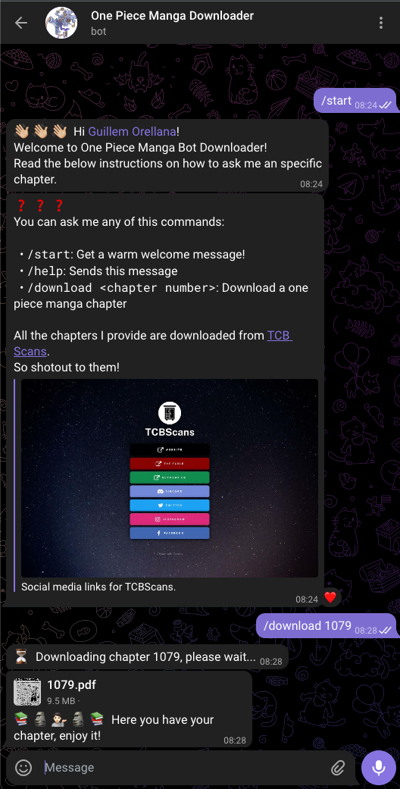

# One Piece Manga Downloader

[](https://t.me/one_piece_manga_downloader_bot)

Download One Piece Manga Chapters from [TCB Scans](https://onepiecechapters.com/mangas/5/one-piece)

## CLI Usage

```bash
$ one-piece-download --help

Usage: one-piece-download [OPTIONS] CHAPTERS

Arguments:
  CHAPTERS  Comma separated chapter numbers you want to download. The chapters
            list also support ranges. For examples, some valid chapter
            selections are: 1,2,3,4 or 1000,1005,1070-1077.  [required]

Options:
  --ouptut-path PATH  Output path for the downloaded chapters.  [default:
                      chapters]
  --help              Show this message and exit.
```

## Telegram bot 🤖

[](https://t.me/one_piece_manga_downloader_bot)

Access the bot [HERE](https://t.me/one_piece_manga_downloader_bot) or by
clicking the shield.



### Deploy it!

> The Telegram Bot it's already deployed and available for everyone [here](https://t.me/one_piece_manga_downloader_bot)!

> ⚠️ This guide will deploy the bot in your AWS account and it will become available
> in Telegram as a completely different one.

Requirements:

- Docker installed. Helps with the AWS Lambda function package creation 🐳
- AWS credentials setup
- Your Telegram Bot's token

1. Move inside the `telegram-bot` directory:

```bash
$ cd telegram-bot/
```

2. Install `node` dependencies (mainly to install `serverless` and the required plugins):

```bash
$ npm install
```

3. Deploy the CloudFormation stack with the `deploy.sh` script:

```bash
sh deploy.sh <BOT_TOKEN>
```
